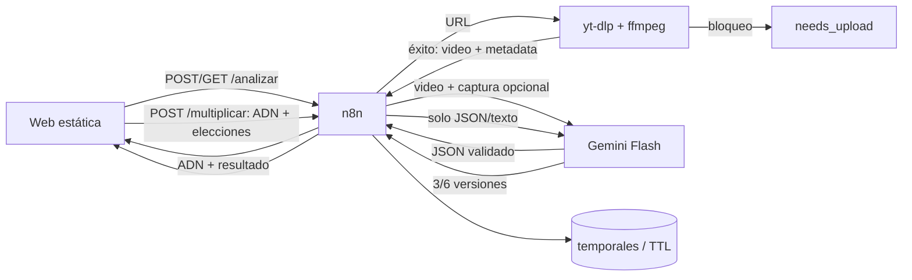

# Multiplicador de Reels — contrato y arquitectura MVP de producción

**Fecha:** 12/09/2026 · **Tipo:** MVP vendible con límites explícitos · **Objetivo:** URL o video → diagnóstico verificable → 3/6 guiones grabables. El stack fijo es correcto porque reutiliza VPS+n8n, deja secretos en servidor y separa la descarga frágil del flujo principal.

## 1. ARQUITECTURA, HERRAMIENTAS Y FLUJO



**Datos/propiedad:** el usuario declara derecho de uso; JR360 conserva workflow, prompts y software; el usuario conserva sus videos y resultados. Videos/capturas se borran al terminar y por barrido TTL. ADN/resultados viven en el navegador; n8n solo guarda el job hasta 24 h.

## 2. CONTRATO API FRONT ↔ N8N (v1)

Base pública propuesta: `https://reel-api.DOMINIO/webhook/v1`. CORS solo para el dominio del front. Todas las respuestas incluyen `request_id`; errores usan `{ "ok":false,"error":{"code":"...","message":"...","retryable":false},"request_id":"..." }`. Nunca exponer claves.

### `POST /analizar`

Acepta **una** fuente: (a) `application/json`: `{"source":{"type":"instagram_url","url":"https://www.instagram.com/reel/ABC/"}}`; o (b) `multipart/form-data`: `video` obligatorio y `insights` opcional. Para URL, la captura opcional viaja como `insights` multipart junto con el campo `instagram_url`. Formatos: video MP4/MOV/WebM ≤150 MB y ≤180 s; captura JPG/PNG/WebP ≤10 MB.

Respuesta inmediata HTTP `202`:
```json
{"ok":true,"job_id":"an_01J...","status":"queued","poll_url":"/analizar?job_id=an_01J...","retry_after_seconds":3,"expires_at":"2026-09-13T18:00:00Z","request_id":"req_01J..."}
```

`GET /analizar?job_id=...` devuelve `202` mientras trabaja (`status`: `queued|downloading|processing|analyzing`) o `200` al terminar:
```json
{"ok":true,"job_id":"an_01J...","status":"completed","source":{"type":"upload","public_metrics":{"views":120400,"likes":8700,"comments":314,"captured_at":"2026-09-12T18:00:00Z"},"insights":{"shares":2100,"saves":1750,"average_watch_seconds":18.4,"completion_rate":0.61},"missing_metrics":["followers_at_publish"]},"analysis":{"traffic_light":"viral","confidence":"high","label":"Alto potencial observado","score":82,"criterion":"Señales disponibles, no garantía de viralidad.","reasons":["Gancho claro antes de 2 s","Compartidos/vistas 1.74%"],"gaps":[]},"dna":{"schema_version":"1.0","duration_seconds":29.8,"language":"es","summary":"Contraste antes/después","hook":{"end_second":2.4,"spoken":"Deja de hacer esto...","on_screen":"ESTÁS PERDIENDO CLIENTES","visual":"primer plano"},"structure":[{"start":0,"end":2.4,"role":"hook","visual":"rostro a cámara","shot":"primer plano","spoken":"Deja de hacer esto...","on_screen":"ESTÁS PERDIENDO CLIENTES","edit":"corte directo"},{"start":2.4,"end":23,"role":"development","visual":"demostración","shot":"plano medio","spoken":"...","on_screen":"Paso 1","edit":"3 cortes"},{"start":23,"end":29.8,"role":"cta","visual":"rostro a cámara","shot":"primer plano","spoken":"Guárdalo...","on_screen":"GUÁRDALO","edit":"zoom"}],"turn":{"second":13.2,"description":"revela el error"},"cta":{"start_second":23,"type":"save","text":"Guárdalo"},"pacing":{"cuts":6,"cuts_per_10s":2.01},"transcript":[{"start":0,"end":2.4,"text":"Deja de hacer esto..."}],"evidence_notes":["Texto leído del fotograma"]},"defaults":{"topic_suggestions":["ventas","educación"],"format":"face","setting":"same","language":"es","versions":3}},"request_id":"req_01J..."}
```

Si Instagram bloquea: HTTP `200`, `status:"needs_upload"`, `upload_reason:"No pudimos abrir ese Reel. Descárgalo y súbelo aquí."`, `accepted_formats:["video/mp4","video/quicktime","video/webm"]`, sin error técnico. Otros finales: `failed` con `INVALID_MEDIA|TOO_LARGE|TOO_LONG|QUOTA_EXHAUSTED|ANALYSIS_FAILED|JOB_EXPIRED`.

### `POST /multiplicar`

`application/json`; el ADN viaja completo, no una referencia frágil:
```json
{"analysis_id":"an_01J...","dna":{"schema_version":"1.0","duration_seconds":29.8,"language":"es","hook":{},"structure":[],"turn":{},"cta":{},"pacing":{},"transcript":[],"evidence_notes":[]},"original_verdict":{"traffic_light":"viral","score":82},"choices":{"topic":"vendo seguros","format":"face","setting":"business","language":"es","versions":3},"generation":{"mode":"new_angles","exclude_angles":[]}}
```
Enums: `format=face|voiceover|text_only`; `setting=home|business|street|same`; `language=es|en`; `versions=3|6`. Si faltan elecciones, HTTP `200` con `status:"needs_approval"` y `suggested_choices` para botones; no genera hasta aprobación. "Dame más" reenvía ADN, elecciones y `exclude_angles` con los ángulos ya usados.

Respuesta `200`:
```json
{"ok":true,"status":"completed","analysis_id":"an_01J...","generation_id":"mul_01J...","applied_structure":"original","versions":[{"id":"v1","angle":"error costoso","hook":"Este error te puede dejar sin cobertura","script":[{"start":0,"end":2.4,"voice":"Este error...","on_screen":"NO PIERDAS TU COBERTURA"},{"start":2.4,"end":23,"voice":"...","on_screen":"REVISA ESTO"},{"start":23,"end":29.8,"voice":"Guárdalo...","on_screen":"GUÁRDALO"}],"shooting_plan":[{"start":0,"end":2.4,"location":"negocio","shot":"primer plano","action":"mira a cámara","on_screen":"NO PIERDAS TU COBERTURA"}],"caption":"Antes de renovar, revisa esto..."}],"request_id":"req_01J..."}
```

## 3. WORKFLOWS N8N Y ERRORES

**Analizar:** 1 Webhook POST → 2 validar origen/tipo/tamaño + normalizar URL → 3 rate limit/IP+cupo diario → 4 crear job/202 → 5 Execute Workflow asíncrono → 6 IF URL: HTTP microservicio; si `download_blocked|private|login_required`, marcar `needs_upload` → 7 validar video con ffprobe → 8 guardar temporal → 9 subir video y captura a Gemini Files API → 10 esperar estado ACTIVE con timeout → 11 Gemini analizar con schema → 12 parsear + validar semántica; un reintento reparador → 13 calcular ratios/score determinista y reemplazar semáforo del modelo → 14 guardar resultado TTL → 15 borrar temporales locales y solicitar borrado de Files API → 16 Error Trigger sanitiza y registra sin contenido.

**Consultar:** 1 Webhook GET → 2 validar job_id → 3 rate limit → 4 leer estado → 5 responder 202/200/404/410.

**Multiplicar:** 1 Webhook POST → 2 validar schema/tamaño → 3 rate limit+cupo → 4 defaults o `needs_approval` → 5 Gemini texto con schema → 6 validar N, tiempos y ángulos únicos; un reintento → 7 respuesta → 8 log mínimo. `429` → `QUOTA_EXHAUSTED` con mensaje "Llegamos al límite de análisis de hoy. Intenta mañana"; `5xx/timeout` → un reintento con jitter y luego error amable.

## 4. MICROSERVICIO DE DESCARGA

`POST /v1/download` interno, JSON `{"url":"...","job_id":"..."}`; header `X-Internal-Token`. `200`: stream MP4 + headers `X-Metadata-Base64` (JSON: views/likes/comments/captured_at). `422`: `download_blocked|private|login_required|unsupported`; `413`: límite; `504`: timeout. `GET /health` → `{"ok":true}`. Cookies de cuenta secundaria **no hoy**: son frágiles, pueden violar condiciones y exponen una cuenta; solo piloto autorizado, cifradas como secreto y nunca personales.

```dockerfile
FROM python:3.12-alpine
RUN apk add --no-cache ffmpeg curl
RUN pip install --no-cache-dir yt-dlp fastapi uvicorn
WORKDIR /app
COPY app.py .
RUN adduser -D app && mkdir /tmp/reels && chown app /tmp/reels
USER app
EXPOSE 8080
HEALTHCHECK CMD curl -f http://localhost:8080/health || exit 1
CMD ["uvicorn","app:app","--host","0.0.0.0","--port","8080"]
```

## 5. PROMPTS Y SCHEMAS GEMINI

**Prompt analizar (video + captura opcional):** "Eres analista forense de Reels. Examina video, audio y, si existe, captura de Insights. Transcribe literalmente; separa lo visible, audible y lo inferido. Segmenta toda la duración sin huecos ni solapes. Identifica gancho 0–3 s, texto, plano, cortes, voz, giro y CTA con segundos decimales. No inventes métricas ni causalidad. Usa `null` cuando no sea legible. Las métricas recibidas son: {{PUBLIC_METRICS}}. Devuelve únicamente JSON conforme al schema. El campo `model_assessment` evalúa ejecución creativa; el backend calcula el semáforo final."

Schema análisis: `{"type":"object","additionalProperties":false,"required":["duration_seconds","language","summary","hook","structure","turn","cta","pacing","transcript","evidence_notes","insights_read","model_assessment"],"properties":{"duration_seconds":{"type":"number"},"language":{"type":"string"},"summary":{"type":"string"},"hook":{"type":"object"},"structure":{"type":"array","items":{"type":"object","required":["start","end","role","visual","shot","spoken","on_screen","edit"]}},"turn":{"type":["object","null"]},"cta":{"type":["object","null"]},"pacing":{"type":"object"},"transcript":{"type":"array","items":{"type":"object","required":["start","end","text"]}},"evidence_notes":{"type":"array","items":{"type":"string"}},"insights_read":{"type":"object"},"model_assessment":{"type":"object","required":["strengths","gaps"]}}}`.

**Prompt multiplicar (solo JSON):** "Eres guionista de Reels para una persona no técnica. Entrada: ADN, veredicto y elecciones. Genera exactamente {{N}} versiones, cada una con ángulo distinto y no incluido en `exclude_angles`. Conserva roles, orden y duración de cada bloque del ADN; adapta tema, formato, escenario e idioma. Si el veredicto no es viral, corrige primero las debilidades indicadas sin alargar la duración. El texto hablado debe poder decirse en el intervalo (máximo 2.5 palabras/segundo en español y 2.8 en inglés). Para `text_only`, voice debe ser cadena vacía; para `voiceover`, no ordenes mirar a cámara. No copies frases distintivas del original salvo expresiones funcionales breves. No prometas resultados ni inventes datos. Caption listo para pegar, sin explicación. Devuelve solo JSON conforme al schema."

Schema multiplicación: `{"type":"object","additionalProperties":false,"required":["applied_structure","versions"],"properties":{"applied_structure":{"type":"string","enum":["original","corrected"]},"versions":{"type":"array","minItems":3,"maxItems":6,"items":{"type":"object","required":["id","angle","hook","script","shooting_plan","caption"],"properties":{"id":{"type":"string"},"angle":{"type":"string"},"hook":{"type":"string"},"script":{"type":"array","items":{"type":"object","required":["start","end","voice","on_screen"]}},"shooting_plan":{"type":"array","items":{"type":"object","required":["start","end","location","shot","action","on_screen"]}},"caption":{"type":"string"}}}}}}`. n8n además valida que el array tenga exactamente N y todas las escenas cubran la duración.

## 6. CRITERIO DE VIRALIDAD

No se afirma viralidad real sin seguidores, alcance, fecha y benchmark de la cuenta. Se muestra **potencial observado**. Ratios cuando existen: interacción pública `(likes+comments)/views`, compartidos/vistas, guardados/vistas, finalización y `average_watch/duration`. Puntaje 0–100: 25 finalización, 20 compartidos, 15 guardados, 10 interacción pública, 20 ejecución (gancho/claridad/ritmo/CTA), 10 confianza de datos. Cada ratio se convierte a percentil contra benchmarks versionados por nicho; **hoy, sin dataset**, se compara solo con umbrales configurables y se etiqueta "estimación inicial". Verde ≥75, amarillo 45–74, rojo <45. Confianza alta con Insights+vistas; media con vistas+interacciones; baja si faltan vistas. Siempre listar datos usados, faltantes y fecha.

## 7. SEGURIDAD, LÍMITES Y OPERACIÓN

- Front sin secretos; TLS; CORS allowlist; webhook no adivinable no sustituye autenticación. Reverse proxy: 5 analizar/h/IP y 20 multiplicar/h/IP; máximo 2 jobs simultáneos/IP; límite diario configurable menor que la cuota real de AI Studio.
- Validar URL `instagram.com`, bloquear redirects/IP privadas (SSRF), MIME real, extensión, duración y tamaño; nombres UUID; usuario sin permisos; contenedor con CPU/RAM/timeout, sin montaje del host.
- No renderizar HTML del modelo; schema+allowlist; logs sin URL completa, video, captura ni ADN; `request_id` sí. Temporales locales: borrado inmediato y barrido ≤1 h; job/resultado: 24 h. Aviso/consentimiento y contacto para eliminación.
- Files API puede retener archivos hasta 48 h; intentar borrado explícito tras analizar y declararlo en privacidad. No prometer $0 ni disponibilidad: al agotar cuota, cerrar nuevos análisis; multiplicaciones quedan sujetas al mismo cupo.
- Volumen inicial seguro: 1 worker de análisis, cola máxima 10, 30 análisis/día **o menor según cuota real**, 6 multiplicaciones/análisis. Mantenimiento: revisar fallos/429/espacio a diario la primera semana; actualizar yt-dlp semanalmente; prueba sintética mensual.

## 8. DESPLIEGUE Y VERIFICACIÓN

1. EasyPanel: servicio privado `reel-downloader` desde Docker, 1 CPU/512 MB, `/tmp` efímero, token secreto; sin dominio público. 2. Crear credenciales Gemini en n8n y variables de límites/TTL; nunca en nodos exportados. 3. Importar/activar workflows y fijar `N8N_PAYLOAD_SIZE_MAX`/proxy acorde a 150 MB; comprobar espacio y timeout. 4. Publicar front estático, configurar `API_BASE`, CORS y proxy rate limit. 5. Stripe Payment Link solo enlaza a compra; **sin cuentas ni webhook, no concede acceso automáticamente**: hoy sirve para cobro/venta asistida, no paywall.

Pruebas: `GET https://reel-api.DOMINIO/health` → `200 {"ok":true}`; subir un MP4 corto autorizado a `POST .../analizar` → `202`, sondear hasta `completed`, ADN cubre 0–duración y archivo local desaparece; URL pública válida → completed o `needs_upload` sin detalle técnico; URL privada → `needs_upload`; archivo 151 MB → `413`; MIME falso → `415`; 6ª petición/IP → `429`; luego `POST .../multiplicar` con el ADN → 3 versiones, ángulos únicos y tiempos válidos. Verificar desde móvil y con letra al 200%. **No declarar producción** hasta aprobar todas.

## 9. VOLUMEN, ESFUERZO, COSTOS, FASES Y EXCLUSIONES

Hoy: 8–12 h combinadas (contrato, front, 2 workflows, microservicio, despliegue y pruebas) si accesos y dominio están listos. Terceros adicionales: $0 mientras Gemini acepte el nivel gratuito y exista capacidad VPS; costo real de operación incluye Contabo/EasyPanel ya pagados y 1–2 h/semana de soporte inicial. Dependencias: cuota Gemini, cambios de Instagram/yt-dlp, recursos VPS y aprobación de privacidad.

Fuera de hoy: cuentas/paywall/entitlements, historial persistente, analítica de producto, benchmarks por nicho, cookies de Instagram, "Mis ganadores" y video IA. Agregar cuentas+control de compra antes de autoservicio público; benchmarks tras ≥100 análisis consentidos por nicho; Mis ganadores cuando el flujo individual convierta; video IA solo después de validar margen como servicio manual.

## 10. OPINIÓN LIBRE — DECIDE JIMMY

1. **Vender "estructura comprobada", no "viralidad".** Reduce una promesa imposible y aumenta credibilidad. Costo $0; cabe hoy cambiando copy.
2. **Código de acceso manual post-Stripe.** Un único código rotativo evita regalar cuota mientras no hay cuentas; no es seguridad fuerte. Costo $0 y 30–60 min; cabe hoy solo si ya existe un comprador.
3. **Ejemplo precargado sin consumir Gemini.** Permite entender el resultado antes de pagar/probar y reduce abandono 50+. Costo $0 y 1 h; cabe hoy si no retrasa la prueba real.

**Handoff pricing:** alcance vendible = análisis individual + 3/6 multiplicaciones; exclusiones arriba; setup 8–12 h; costo marginal monetario no garantizado en $0; soporte 1–2 h/semana inicial. El precio debe cubrir soporte, fragilidad de descarga y futura migración a cuota pagada, no basarse en "IA gratis".
